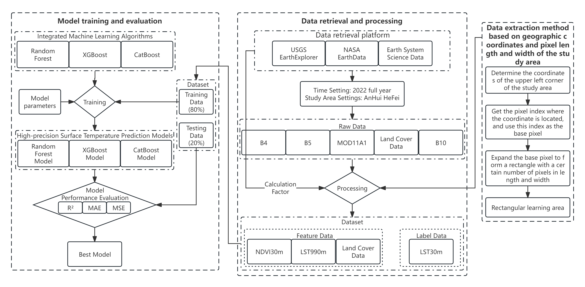
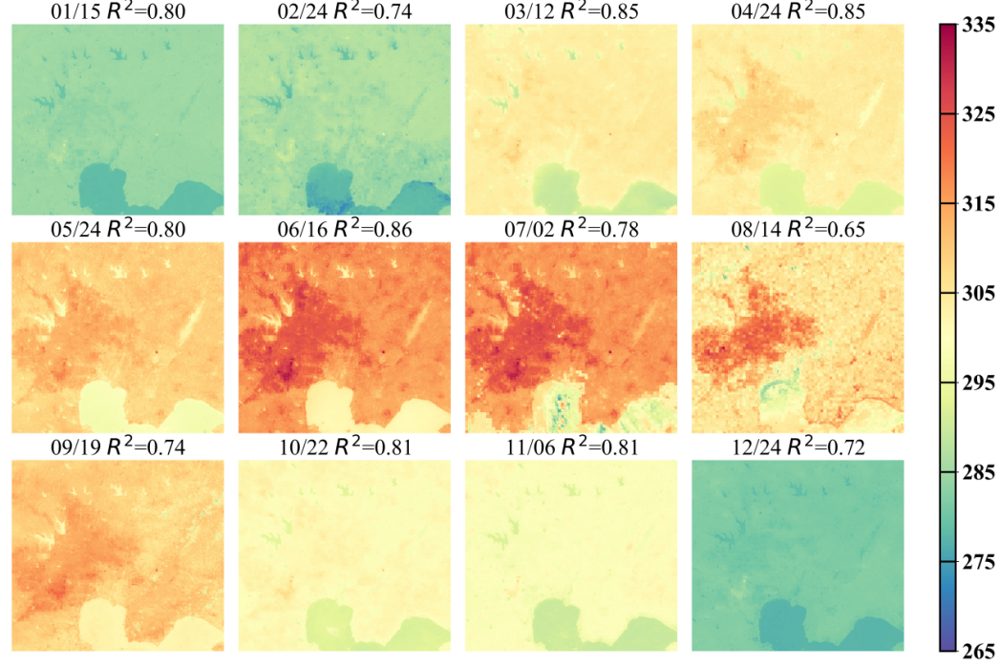

# LongTermHiResLST

English | [中文](README_ZH.md)

High-resolution land surface temperature (LST) prediction method that fuses MODIS and Landsat products, boosts spatial detail with machine learning, and ships ready-to-publish diagnostics.

---

## 🛰️ Overview
- **Goal**: upscale daily MODIS LST (990 m) to 30 m resolution over long periods using vegetation (NDVI), land-use masks, and per-month regression models.
- **Scope**: ingestion & cleanup of satellite products, QA masking, per-month Random Forest training/prediction, optional CatBoost/XGBoost/Transformer experiments, validation, and publication-ready figures.
- **Outputs**: monthly 30 m prediction rasters, temporal statistics, accuracy plots, land-cover error studies, and composite storyboards (flowchart + 12-month forecast + resolution comparison).

## 📦 Repository Map
| Path | Purpose |
| --- | --- |
| `Preprocessing/` | Scripts for MODIS/Landsat ingestion, clipping, resampling, QA filtering, statistics, and figure generation (e.g., `FullYearPro.py`, `LandsatPreprocessing.py`). |
| `Preprocessing/ValidatlyProcessing/` | Smaller AOI validation utilities (`Validate.py`, `DataProcessing.py`). |
| `LST_Tools/` | Shared helpers for raster IO, projections, NDVI, QA-aware prediction, and metric plots. |
| `Training/` | Model launchers (Random Forest, CatBoost, XGBoost, Transformer super-resolution prototype). |
| `Visualization/` | High-level plotting scripts plus exported figures referenced below. |

## 🔁 Process
1. **Acquire & Stage** raw MODIS (HDF) and Landsat (B4/B5/B10) scenes plus land-cover products under `F:/MyProjects/MachineLearning/Data`.
2. **Preprocess** using `Preprocessing/LandsatPreprocessing.py`, `ModisPreprocessing.py`, and `FullYearPro.py` to obtain NDVI/LST stacks, QA masks, and per-month tiles.
3. **Train Monthly Models** with `Training/Training_Usable.py` (Random Forest baseline) or alternative learners (`CatBoost.py`, `XGBoost.py`, `Transformer.py`).
4. **Forecast & Validate** via `Preprocessing/Predicting.py` and `Preprocessing/ValidatlyProcessing/Validate.py`.
5. **Analyze & Visualize** KPIs using scripts such as `StatisticalAnalysis.py`, `StabilityAnaly.py`, `Visualization1.py`, etc.

| Stage | Command | Notes |
| --- | --- | --- |
| Landsat preprocessing | `python Preprocessing/LandsatPreprocessing.py` | Groups B4/B5 files, computes NDVI, clips to AOI, prepares 30 m LST. |
| MODIS preprocessing | `python Preprocessing/ModisPreprocessing.py` | Extracts MODIS LST, mosaics tiles, reprojects to UTM, resamples to 30 m proxies. |
| Full-year MODIS prep | `python Preprocessing/FullYearPro.py` | Automates yearly ingest → mosaics → reprojection → resampling → monthly folders for both LST and QC. |
| Feature generation | `python Preprocessing/FullYearPre.py` | Loads per-month NDVI/MODIS/type stacks, applies QA filtering, writes monthly prediction-ready rasters. |
| Training (monthly RF) | `python Training/Training_Usable.py` | Trains/loads 12 Random Forest models, reports R², and triggers inference for each month. |
| Alternative models | `python Training/CatBoost.py`, `Training/XGBoost.py`, `Training/Transformer.py` | Drop-in experimentation; update hyperparameters as needed. |
| Prediction reruns | `python Preprocessing/Predicting.py` | Batch inference when models already exist; skips outputs already on disk. |
| Validation slice | `python Preprocessing/ValidatlyProcessing/Validate.py` | Predicts on independent Jiangsu AOI, prints R², saves raster. |
| Visualization | `python Visualization/Visualization1.py` (and others) | Generates comparison panels, scatter audits, rolling stats, and land-cover breakdowns. |

## 🧰 Core Modules
- **`LST_Tools/Tool1.py`** – 1k+ lines of reusable raster utilities: HDF extraction, reprojection, mosaicking, clipping, resampling, QA handling (`preprocessing_QA_folder`), NDVI computation, predictor assembly (`predict_and_save`), and metric plotting (`model_accuracy`, `plot_mae/mse`, KDE caching).
- **`LST_Tools/Tool2.py`** – Dataset orchestration (path presets, QA-based filtering, data loaders) for consistent training/test splits and batch inference.
- **Preprocessing scripts** – Specialized tasks such as `FullYearPro.py` (full-year MODIS conversion & monthly bucketing), `StabilityAnaly.py` (cloudiness vs. R²), `StatisticalAnalysis.py` (daily cloud/LST logs), `To_shp.py` (boundary extraction), `YearTemAnalysis.py` (Meteostat weather vs. LST trends), and numerous plotting helpers (`Drawing*.py`, `Printing*.py`, `test*.py` templates).
- **Training scripts** – Baseline Random Forest trainer with QA-masked per-month splits, GPU-enabled XGBoost, CatBoost, and an experimental Transformer super-resolution network.
- **Visualization scripts** – Publish-ready panels comparing resolutions, land-cover statistics, and correlation heatmaps.

## 🚀 Getting Started
### Prerequisites
- Python 3.11+, GDAL 3.x, rasterio, numpy, pandas, matplotlib/seaborn/plotly, shapely, scikit-learn, catboost, xgboost, cupy (CUDA), torch (for Transformer), meteostat, pillow.
- GDAL/PROJ must be installed system-wide before `pip install rasterio`.
- GPU acceleration is used by XGBoost (CUDA hist) and the Transformer; ensure `nvcc` + matching PyTorch build.

### Data Configuration
- The scripts assume the directory layout under `F:/MyProjects/MachineLearning/Data/...`. Update paths inside `LST_Tools/Tool1.py` & `Tool2.py` or parameterize the scripts to reflect your storage.
- Some data needs to be renamed to be recognized by the filtering logic.

### Monthly Forecast Storyboard

Twelve stitched panels summarize the full-year LST dynamics and make it easy to spot seasonal anomalies once `Training/Training_Usable.py` finishes generating monthly rasters.

## ✅ Quality & Validation
This project contains multiple quality verification functions; for example, QA filtering combined with regression metrics, land-cover-specific error analysis, and cross-checks against ground weather observations.
- **QA-aware masking** – `Tool1.predict_and_save` and `Tool2.filter_data_based_on_qa` ensure training/prediction ignore cloudy pixels (QA == 0/2).
- **Metrics** – `Tool1.model_accuracy`, `Tool1.print_model_R2`, `Preprocessing/StabilityAnaly.py`, and `LCErrorAnalysis.py` provide MAE/MSE/R² summaries and land-cover-specific error boxes.
- **Weather cross-check** – `YearTemAnalysis.py` correlates Meteostat averages with predicted LST (+ scatter diagnostics with R² annotation).
- **Density diagnostics** – KDE caching (`get_density_data`, `simple_gpu_kde`) accelerates repeated metric plotting for multiple models.

### Resolution Enhancement Showcase

This comparison highlights how the trained models upsample MODIS-scale inputs into detail-rich 30 m products, visually verifying the value of prediction methods.

## 📝 Notes
- Paths and parameter names remain hard-coded to `F:/MyProjects/MachineLearning/Data`; audit each script before running on a different platform.
- Several routines expect month-sorted filenames (`Predict_LST_MM.tif`, `_QA_Usable.tif`, etc.); inconsistent naming can silently break batching.
- GPU-heavy scripts (`XGBoost.py`, `Transformer.py`) assume CUDA-capable hardware and may fail if drivers or memory limits are insufficient.
- GDAL-based preprocessing writes intermediate files in-place—ensure you have backups before rerunning on shared directories.

## 🛡️ License & Attribution
- Code is released under the Apache License 2.0 **with** the additional patent notice contained in `LICENSE`. Commercial redistribution requires written permission from Anhui Agricultural University.
- Cite the authorship note in `LICENSE` when sharing derived models or figures.
